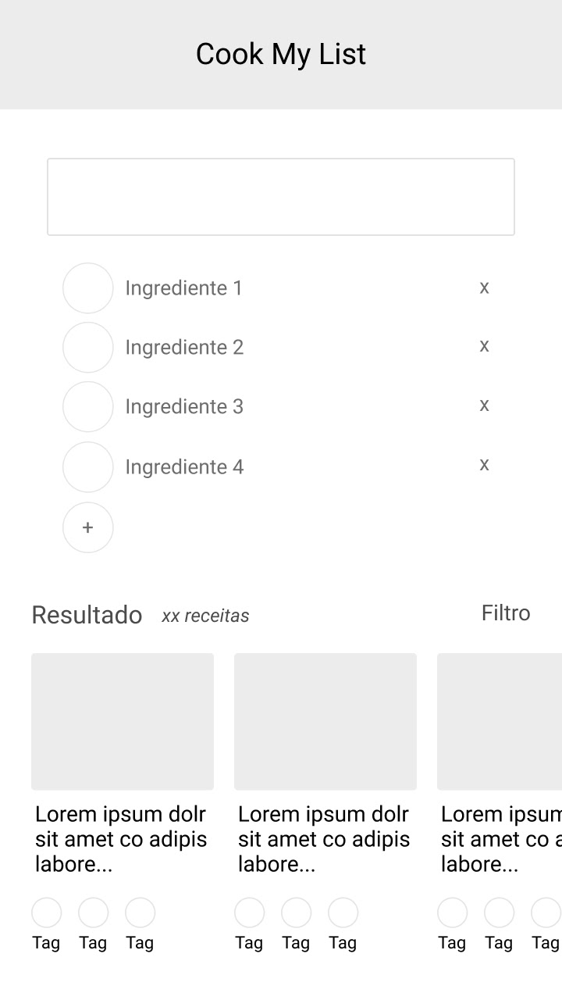
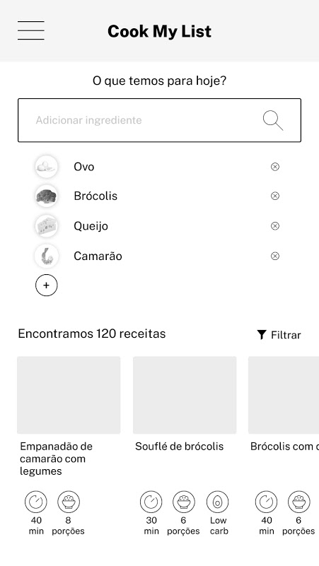
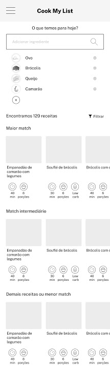
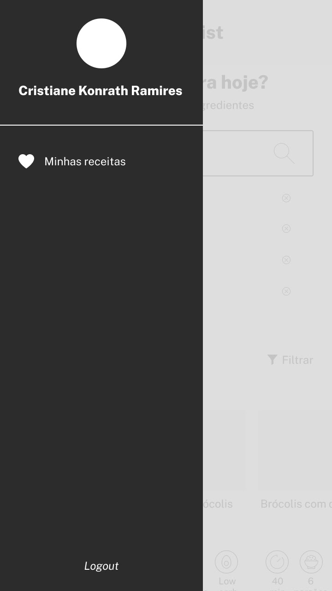

# Cook My List

## 🔬 Technologies

- Language: Typescript
- Runtime Framework: [React Native](https://reactnative.dev/) via [Expo](http://expo.io/) (tested only on iPhone)
- UI Framework: [UI Kitten](https://akveo.github.io/react-native-ui-kitten/) for React Native

## 🚀 How to use

#### 💻 Macbook Setup

- Ensure to have node 14x or greater - use [nvm](https://github.com/nvm-sh/nvm) to manage your node versions.
- Ensure you have XCode installed with a fairly recent iPhone simulator available.
- Install dependencies `yarn`
- Run the iOS version `yarn ios`


##### Linting

```bash
yarn lint
```

##### Testing

```bash
yarn test
```

## Screens

<details>
  <summary>Home</summary>
  
</details>
<details>
  <summary>Home Detalhado</summary>
  
</details>
<details>
  <summary>Home Detalhado Scroll</summary>
  
</details>
<details>
  <summary>Home Detalhado</summary>
  
</details>
<details>
  <summary>Receita</summary>
  
</details>
<details>
  <summary>Menu (Drawer)</summary>
  
</details>


